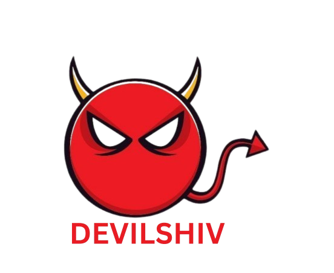

<div align="center">
  
  <h1>My Portfolio – Shivank Tripathi</h1>
  <p>Modern portfolio built with React 19, Vite, and Tailwind CSS</p>
</div>

---

## ✨ Overview

This repository hosts my personal developer portfolio. It highlights my skills, projects, internships, and contact information with a fully responsive layout, dark/light themes, smooth animations, and GSAP-powered transitions. The project is optimized for fast load times with lazy-loaded images, eager hero assets, and async decoding to keep the UX snappy after deployment.

Live site: **[shivanktripathi.vercel.app](https://shivanktripathi.vercel.app/)**

---

## 🚀 Features

- **Interactive Landing Page** with hero CTA, social icons, and animated profile image.
- **Experience Section** showcasing internships, detail routes, and logos.
- **Project Grid + Detail Pages** with GSAP animations, external links, and tech stacks.
- **Skills & About Sections** to outline technical strengths and personal background.
- **Contact Page** with email form (mailto), custom WhatsApp message launcher, and contact cards.
- **Theme Support** using a custom `ThemeContext` for light/dark modes.
- **Performance Enhancements**
  - Lazy loading & async decoding for all non-critical imagery.
  - Eager loading for hero and project detail hero images.
  - Optimized asset pipeline via Vite + Tailwind JIT.
  - Code splitting for React, GSAP, and React Icons vendors.
  - Optimized chunk sizes for better caching.
- **SEO Optimized**
  - Complete meta tags for search engines.
  - Open Graph and Twitter Card support.
  - Robots.txt and sitemap ready.
  - Semantic HTML structure.
- **PWA Ready**
  - Web app manifest for installability.
  - Theme color support.
  - Optimized for mobile and desktop.
- **Responsive Design** across mobile, tablet, and desktop breakpoints.

---

## 🛠 Tech Stack

| Category        | Tools |
|-----------------|-------|
| Frontend        | React 19, Vite 7, Tailwind CSS 4 |
| Animations      | GSAP, custom transitions |
| Routing         | React Router DOM 7 |
| Icons           | React Icons |
| Tooling         | ESLint, PostCSS, Autoprefixer |

---

## 📂 Project Structure

```
src/
├── assets/                # Static images & logos
├── components/            # Shared UI (Header, Loading, PageTransition)
├── constants/             # Data sources (projects, experience, skills, nav)
├── contexts/              # ThemeContext for dark/light mode
├── pages/                 # Route components (Home, Projects, Contact, etc.)
├── index.css              # Tailwind & global styles
└── main.jsx               # React root
```

---

## ⚙️ Getting Started

### 1. Clone & Install
```bash
git clone https://github.com/devilshiv-07/My-Portfolio.git
cd My-Portfolio
npm install
```

### 2. Run Locally
```bash
npm run dev
```
Visit the URL printed in the terminal (default: `http://localhost:5173`).

### 3. Build for Production
```bash
npm run build
```
The optimized output is generated in the `dist/` folder.

### 4. Preview Production Build
```bash
npm run preview
```

---

## 🧰 Useful Scripts

| Command            | Description                                      |
|--------------------|--------------------------------------------------|
| `npm run dev`      | Start Vite dev server with hot reload            |
| `npm run build`    | Bundle the app for production                    |
| `npm run preview`  | Serve a production build locally                 |
| `npm run lint`     | Run ESLint on the project                        |

---

## 📸 Image Optimization Tips

- Keep source assets compressed (use TinyPNG / Squoosh) before committing.
- Favor WebP/AVIF where supported; supply PNG/JPEG fallbacks if required.
- All `` tags already use `loading="lazy"` + `decoding="async"` except critical hero assets, which are prefetched using `fetchpriority="high"`.
- For additional gains, serve the site via a CDN (Vercel, Netlify, Cloudflare) to take advantage of edge caching.

---

## 🎯 Recent Improvements

### SEO & Performance
- ✅ Added comprehensive meta tags (description, keywords, author)
- ✅ Implemented Open Graph tags for social media sharing
- ✅ Added Twitter Card support
- ✅ Created robots.txt for search engine crawlers
- ✅ Optimized HTML with semantic structure
- ✅ Added theme color meta tag

### PWA Support
- ✅ Created manifest.json for web app installability
- ✅ Added app icons configuration
- ✅ Configured standalone display mode

### Build Optimizations
- ✅ Code splitting: Separated React, GSAP, and React Icons into vendor chunks
- ✅ Improved caching strategy with manual chunks
- ✅ Optimized bundle sizes (React: 43KB, GSAP: 69KB, Icons: 2.5KB)
- ✅ Added preconnect hints for external resources

### Content Updates
- ✅ Added CodeFlex project (Next.js 15, Convex, Clerk, AI integration)
- ✅ Updated skills section with 40+ technologies
- ✅ Added custom skill icons (GSAP, Redux Toolkit, Clerk, Convex, etc.)
- ✅ Added location to contact information
- ✅ Improved professional title and branding

---

## 📞 Contact

- **Email:** [er.shivank07@gmail.com](mailto:er.shivank07@gmail.com)
- **Phone / WhatsApp:** +91 9153953678
- **LinkedIn:** [linkedin.com/in/shivanktripathi](https://linkedin.com/in/shivanktripathi)
- **GitHub:** [github.com/devilshiv-07](https://github.com/devilshiv-07)
- **Instagram:** [instagram.com/shivank618](https://www.instagram.com/shivank618/)

---

## 📝 License

This project is released under the MIT License. You’re free to fork and adapt it—just give credit where appropriate.

---

If you have feedback or want to collaborate, feel free to open an issue or reach out through the contact links above. Thanks for checking out my portfolio! 🙌
